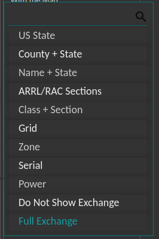

## Configuration & Resets

General Notes

For any form, make sure to click the submit to save. Each section saves separately.

---

### Cluster with Dupes
Telnet Host configuration: w3lpl.net:7373

---

### Cluster without Dupes
Telnet Host configuration: dxc.ve7cc.net:23

---

### Radio Names
Enter the NETBIOS name into the top of the form and click submit.  Then click the dropdown to add the PC to the Dashboard (Radio1 - Radio6).
Note you must use the NETBIOS name from the logging computer that is connected to each radio. If using N1MM, head to the network status (Window drop down -> Network Status) for more NETBOIS PC information.

---

### Contest Configuration
#### Exchange
Below are the options that display on the main dashboarad page for logged QSO's. Please click the correct received exchange.
(when in doubt use Full Exchange)

#### Category
Currently the options are the following.
SO1V - 1 VFO
SO2R - Single Op 2 Radio
Multi-Op

#### Contest Callsign
Enter in the callsign used for the contest.

#### Dashboard Rate
You can choose if you want the main dashboard to have the radio Qs/Hr vs operator Qs/hr.

---

### Cluster Login Callsign
Enter in the callsign used to log into the cluster servers.

---

### Online Scoreboard

#### Contest Name
Enter in the Contest ID.  To find the Contest ID for the current contest go to https://contestonlinescore.com/settings/ and look up the contest name and assoicated Contest ID.

---

### Announcements

#### Say Multi On/Off
Toggle audio on or off for announcment of a multiplier. 

#### Great Circle Lines On/Off
Toggle great circle lines to be drawn on/off on the main map.

#### Lightning Info Enable
Toggle lightning notification on/off.  Togging off to on will connect to the lighting data stream.  Be aware, this data stream is every lighting strike in the world and it bandwidth heavy on the Pi.  Only enable in high bandwidth settings.  Toggling on to off will restart Node Red.

### Lightning Circle (KM)
Move the slider for the dashboard to alert when lightning is detected wthin that distance. 

---

### Dashboard Upgrade

#### Rolling Release

Rolling Release is the dev branch on github.
If there is any issue with changing this, you need to use the follow command in the root folder of the node-red project.

* `git checkout origin/dev`

To change back use 

* `git checkout master`.

---

### Call Lookup Engine & Login

Options are HamDB, QRZ, and HamQth.
QRZ needs an XML subscription, while HamQth does need a login.
HamDB has limited functionality (USA/VE).

Enter in your username and password for the selected database and choose submit.  If correct, you will receive an accepted dialog box.  If not correct you will receive a wrong username/password dialog box.

---

### Measurement Units

Choose the distance units for mapping functions.  Choices are miles or kilometers.

Temperature has options of Celsius or Fahrenheit.  This is for monitoring the Raspberry Pi.

---

### Backup & Restore

Choose the correct operating system.  Linux or Windows.

---

### OP Competition Sort By

The options to control on the Op Competition page are as follows:
* by QSOs
* by Score
* by Mults

---

### Map Configuration

#### Home Lat & Lon
Enter in your QTH lat and lon.  Click submit.  You will receive a dialog box when entered in successfully. 

#### Label
Choose the type of label on each mapped QSO pin.  Choices are Band Only, Band + Mode, Mode Only, Call Only.

---

### Radiosport.live Data

#### Send Data
Experimental, this sends dashboard data to a central server.  More to come.

#### Power
Select power used in the contest.  Choices are QRP, LP, HP.

#### Class
Select your current operating class.  

---

### Database Reset (IMPORTANT BEFORE EVERY CONTEST)
Click "DELETE ALL QSOS AND CLEAR STATS" before each contest to clear the database.

"QUERY ALL CONTESTS IN DB" will display all the contest stored in the database.

"CLEAR STATS ONLY" will only clear the current stats.

---
